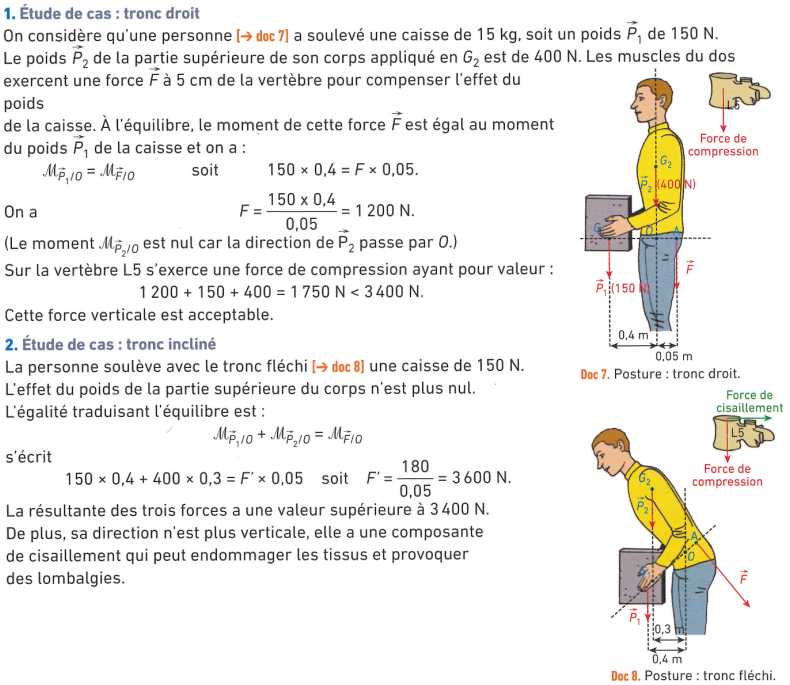

---
title: "Soulever une charge"
geometry: "top=2cm, right=1.5cm, left=1.5cm, bottom = 1cm"
header-left: "PHYSIQUE-CHIMIE |\\hspace{1cm}"
header-center: "\\thetitle"
header-right: "| Co-Intervention"
fontsize: 14pt
table-use-row-colors: true
...

## Activité Documentaire

**Situation**

**Questions** :

 1. Quelle est l'unité de mesure de la masse ?
   
 2. Quelle est l'unité de mesure d'une force ?
   
 3. Quelle autre paramètre que le poids est à prendre en considération lorsqu'on soulève une charge ?