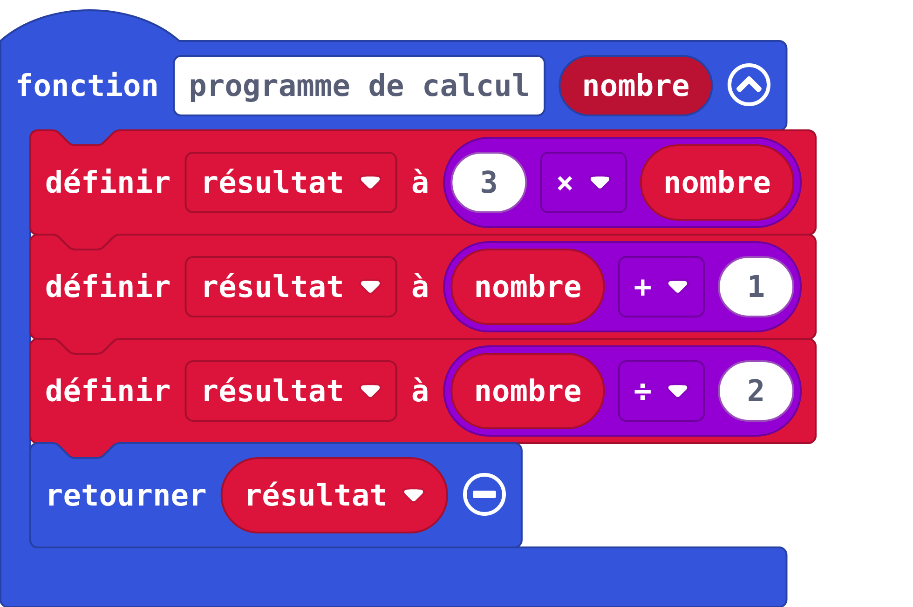
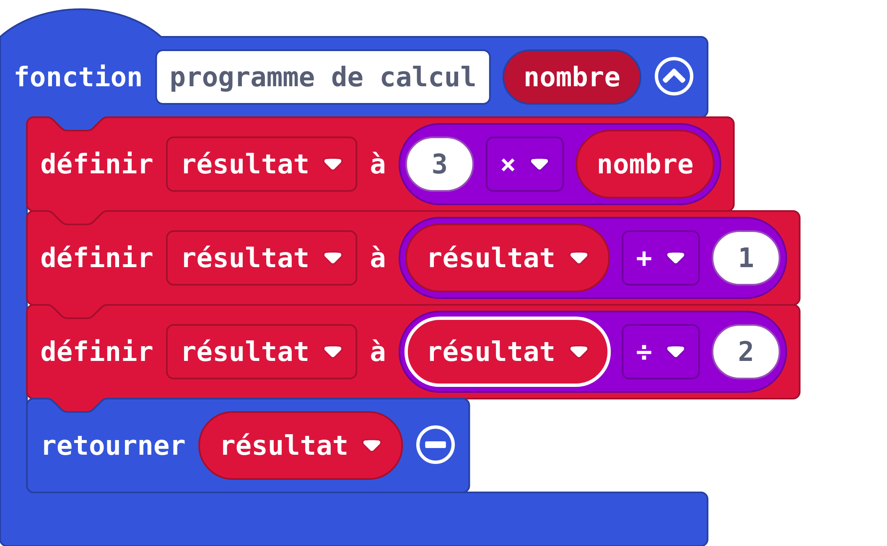

---
title: "Découvrir les fonctions"
geometry: "top=2cm, right=1cm, left=1cm, bottom = 1cm"
header-left: "MATHÉMATIQUES |\\hspace{1cm}"
header-center: "\\thetitle"
header-right: "| Algèbre&Analyse"
subject: "AA1"
keywords: [fonctions, algorithme]
lang: "fr"
table-use-row-colors: true
fontsize: 14pt
...

### Situation : programme de calcul

Voici un programme de calcul :

    - Recevoir un nombre.
    - Multiplier ce nombre par 3
    - Ajouter 1 au résultat
    - Diviser le résultat par 2
    - Retourner le résultat
      
Quel nombre est renvoyé par la fonction lorsqu’elle reçoit le nombre :

    -2 ? 	0 ?		3 ?     10 ?

### Situation : avec les blocs

Parmi les deux programmes donnés ci-dessous, lequel correspond au programme de calcul précédent ?

Que retourne l'autre programme ?