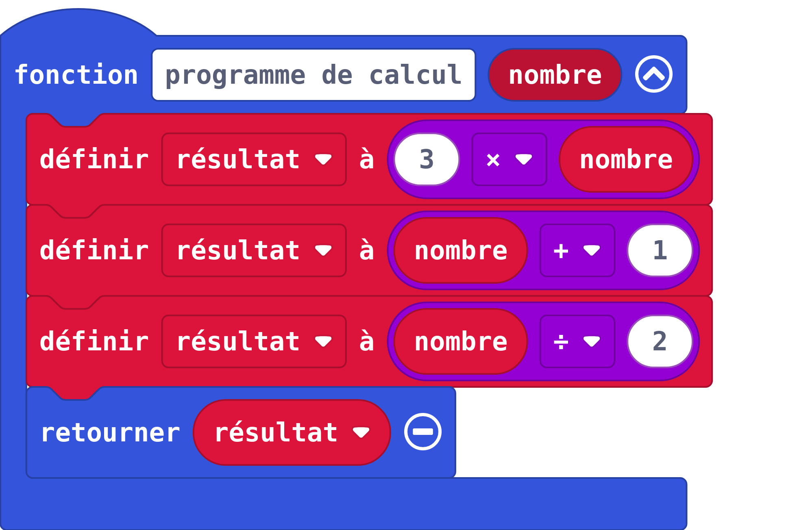
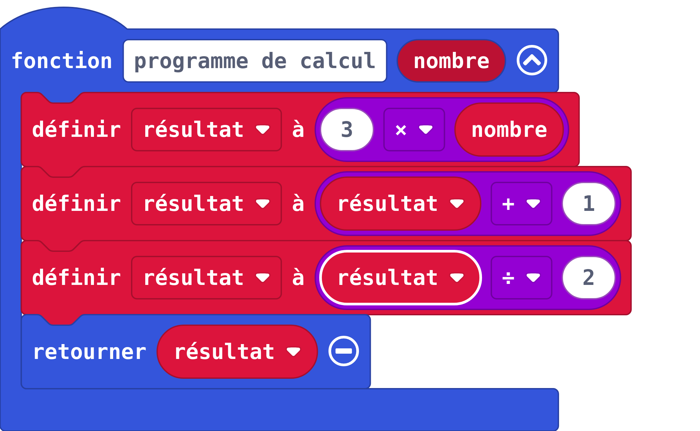
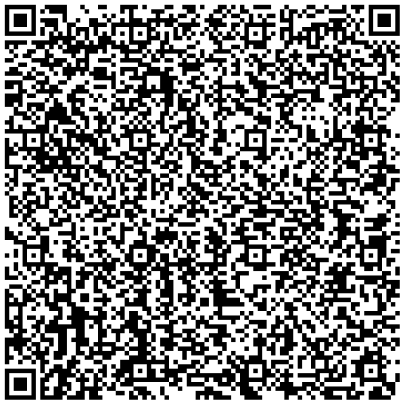

---
title: "Découvrir les fonctions"
geometry: "top=2cm, right=1cm, left=1cm, bottom = 1cm"
header-left: "MATHÉMATIQUES |\\hspace{1cm}"
header-center: "\\thetitle"
header-right: "| Algèbre&Analyse"
subject: "AA1"
keywords: [fonctions, algorithme]
lang: "fr"
table-use-row-colors: true
fontsize: 14pt
...

### Situation : programme de calcul

Voici un programme de calcul :

- Recevoir un nombre.
- Multiplier ce nombre par 3
- Ajouter 1 au résultat
- Diviser le résultat par 2
- Retourner le résultat


Quels sont les nombres renvoyés par la fonction lorsqu’elle reçoit les nombres suivant :

-2 ? 	0 ?		3 ?     10 ?


### Situation : programmation par bloc

Parmi les deux programmes donnés ci-dessous, lequel correspond au programme de calcul précédent ?

{width=8cm}  


{width=8cm}  


Que retourne l'autre programme ?


### Situation : programmation en python

Parmi les programmes définis ci-dessous, lesquels correspondent au programme de calcul initial ?

 - programme 1 :

```python
def programme_de_calcul1(nombre):
    resultat = 3*nombre
    resultat = resultat + 1
    resultat = resultat / 2
    return resultat
```

 - programme 2 :

```python
def programme_de_calcul2(x):
    resultat = 3*x
    resultat = resultat + 1
    resultat = resultat / 2
    return resultat
```

 - programme 3 :

```python
def programme_de_calcul3(nombre):
    nombre = 3*nombre
    nombre = nombre + 1
    nombre = nombre / 2
    return nombre
```

 - programme 4 :

```python
def fonction(antecedent):
    antecedent = 3*antecedent
    antecedent = antecedent + 1
    antecedent = antecedent / 2
    return antecedent
```

{width=5cm}
