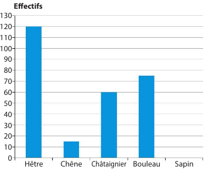
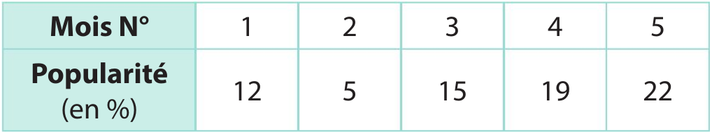
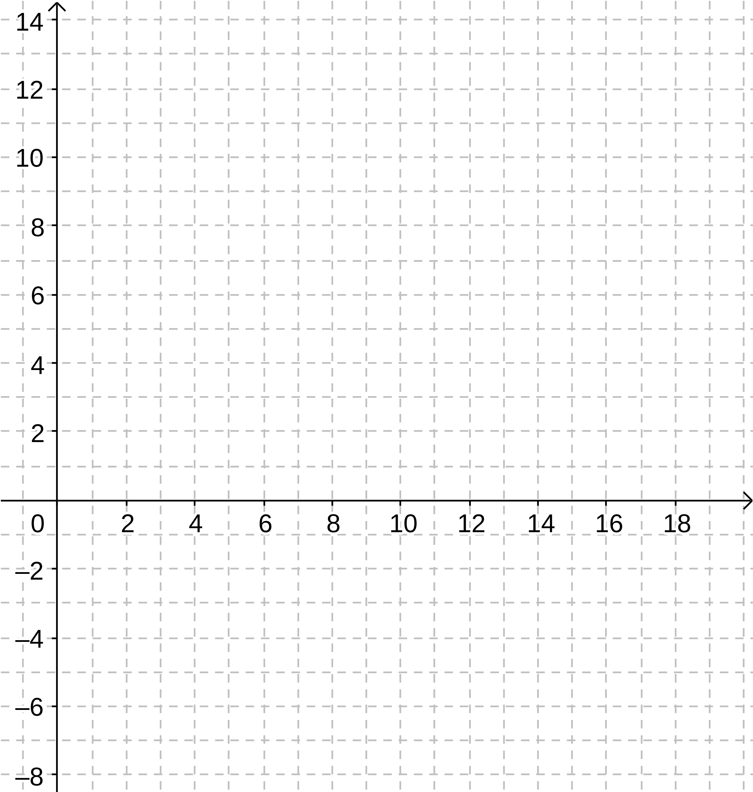
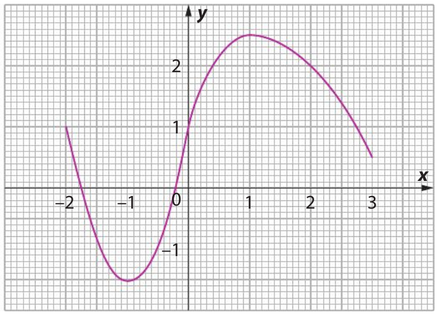

---
title: "Statistique / Fonctions"
geometry: "top=2cm, right=1cm, left=1cm, bottom = 1cm"
header-left: "MATHÉMATIQUES |\\hspace{1cm}"
header-center: "\\thetitle"
header-right: "| ÉVALUATION"
subject: "AA1, SP1"
keywords: [fonctions, statistique]
lang: "fr"
table-use-row-colors: true
fontsize: 12pt
...
## NOM, prénom :

## Exercice 1
Sur une parcelle de forêt, on compte 300 arbres : des hêtres, des chênes, des châtaigniers, des bouleaux et des sapins. 

{width=400px}  

1. Relever les effectifs dans le tableau ci-dessous.
2. Calculer les fréquences correspondantes aux effectifs.

\renewcommand{\arraystretch}{2}
\begin{tabular}{|l|p{2cm}|p{2cm}|p{2cm}|p{2cm}|p{2cm}|r|}
  \hline
  \Large{Espèce} & Hêtres & Chênes & Châtaigniers &  Bouleaux & Sapins & TOTAL\\
  \hline
  \Large{Effectifs} & ~ & ~ & ~ & ~ & ~ & ~\\
  \hline
  \Large{Fréquences} & ~ & ~ & ~ & ~ & ~ & ~\\
  \hline
\end{tabular}

## Exercice 2

Chaque fin de mois, un institut de sondages publie la cote de popularité d’un champion sportif. 
Voici les résultats obtenus sur 5 mois.

{width=400px}

1. Donnez le type de diagramme approprié pour représenter cette série. Justifiez.

\ 

2. Construisez ce diagramme en utilisant la grille page suivante.

{width=80%}

## Exercice 3

Soit la fonction $f$ définie par : $f(x) = 2x - 6$ .

1. Compléter le tableau de valeurs suivant :

\renewcommand{\arraystretch}{1.5}
\begin{tabular}{|l|p{1cm}|p{1cm}|p{1cm}|p{1cm}|p{1cm}|p{1cm}|p{1cm}|}
  \hline
  \ $x$ & 0 & 1 & 2 &  3 & 6 & 8 & 10\\
  \hline
  \ $f(x)$ & ~ & ~ & ~ & ~ & ~ & ~ & ~ \\
  \hline  
\end{tabular}

2. Représenter cette fonction dans le repère ci-dessous.

{width=300px}

## Exercice 4

Voici la représentation graphique de la fonction $h$ pour $x$ variant entre -2 et 3.

{width=60%}

1. Quelle est l'image de 1 par la fonction ?

\ 

2. Quel est l'antécédent de -1,5 par la fonction ?

\ 

3. Compléter le tableau de valeurs de cette fonction :

\renewcommand{\arraystretch}{1.5}
\begin{tabular}{|l|p{1cm}|p{1cm}|p{1cm}|p{1cm}|p{1cm}|p{1cm}|}
  \hline
  \ $x$ & -2 & -1 & 0 &  1 & 2 & 3 \\
  \hline
  \ $h(x)$ & ~ & ~ & ~ & ~ & ~ & ~  \\
  \hline  
\end{tabular}

