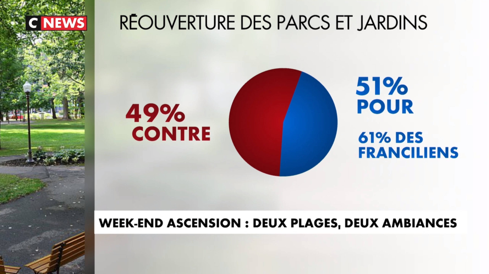
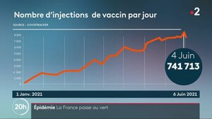
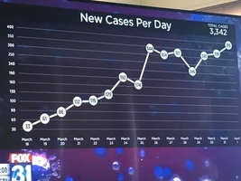
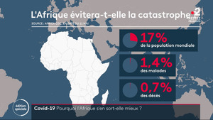
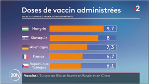
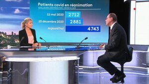

# Traiter des données statistiques

---

## Activité

**Consigne** : observer attentivement chacun des diagrammes présentés et relever les erreurs commises.

  
  
*parcs*

  
*étudiants*

  
*dépistage COVID*

  
*nombre d'injections*

  
*nouveaux cas*  

*Afrique*

  
*doses*

  
*réanimation*