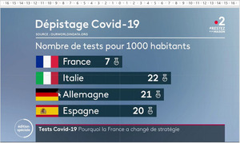

# Traiter des données statistiques

---
## Activité
**Consigne** : observer attentivement chacun des diagrammes présentés et relever les erreurs commises.
source : Covid19 - Les graphiques #NIFNAF (https://padlet.com/julia_dumont/covid19)

  
  
*étudiants*

  
*dépistage COVID*

  
*nombre d'injections*

  
*nouveaux cas*  

  
*doses*

  
*réanimation*

**Consigne**

Choisir un des diagrammes, extraire les informations dans un tableau et représenter celles-ci par un diagramme de votre choix.