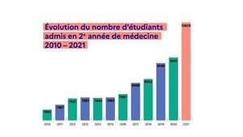

---
title: "Traiter des données"
geometry: "top=2cm, right=1cm, left=1cm, bottom = 1cm"
header-left: "MATHÉMATIQUES\\hspace{1cm}"
header-center: "\\leftmark"
header-right: "|Statistiques&Probabilités"
subject: "Statistiques&Probabilités"
keywords: [Données, Diagrammes, Erreurs]
lang: "fr"
table-use-row-colors: true
...

# Traiter des données statistiques

## Activité
**Consigne** : observer attentivement chacun des diagrammes présentés et relever les erreurs commises.

*source* : [Covid19 - Les graphiques #NIFNAF (https://padlet.com/julia_dumont/covid19)](https://padlet.com/julia_dumont/covid19)

  
{width="2cm"}  caption

\includegraphics[width=5cm]{res/nifnaf_etudiants_medecine.jpeg}

**Consigne** : Choisir un des diagrammes, extraire les informations dans un tableau et représenter celles-ci par un diagramme de votre choix.

