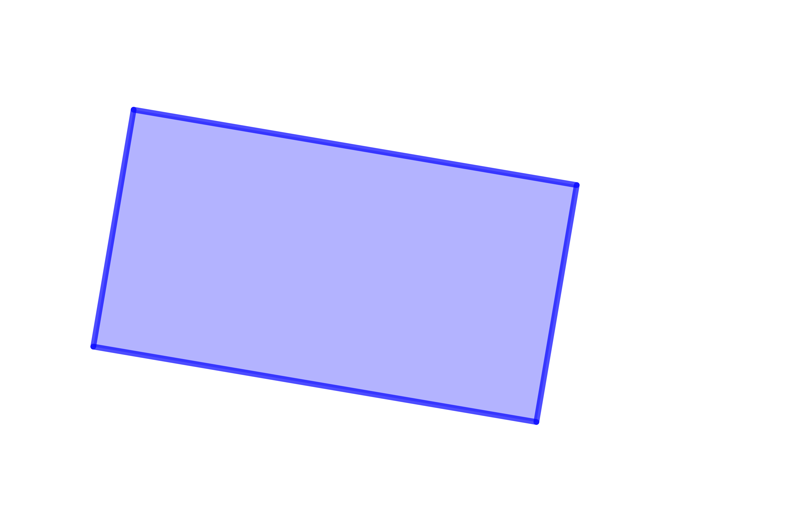
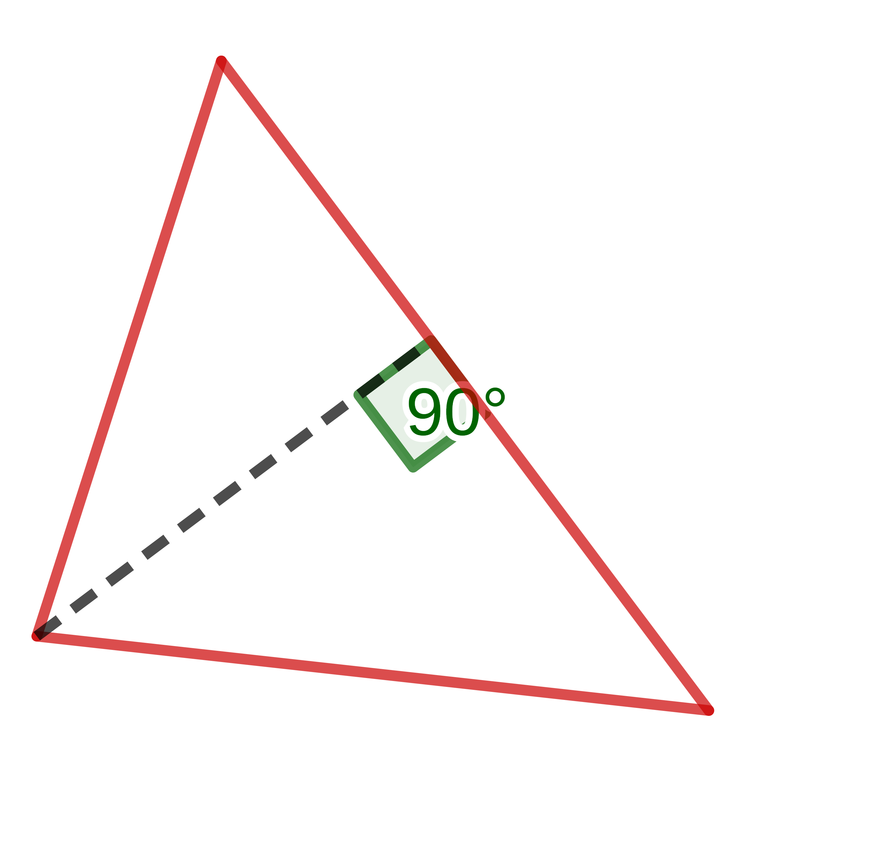
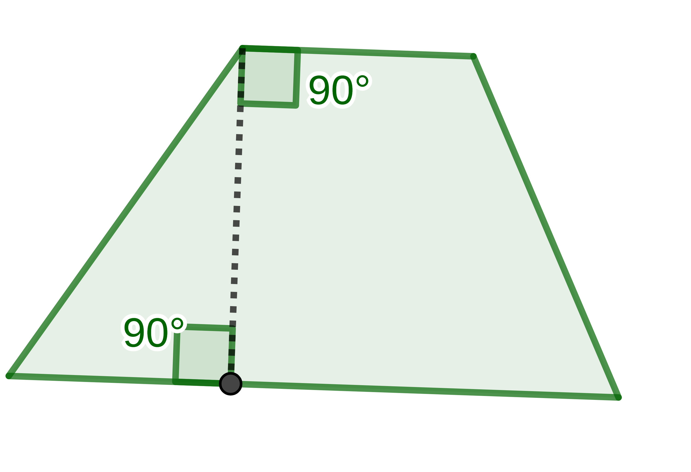
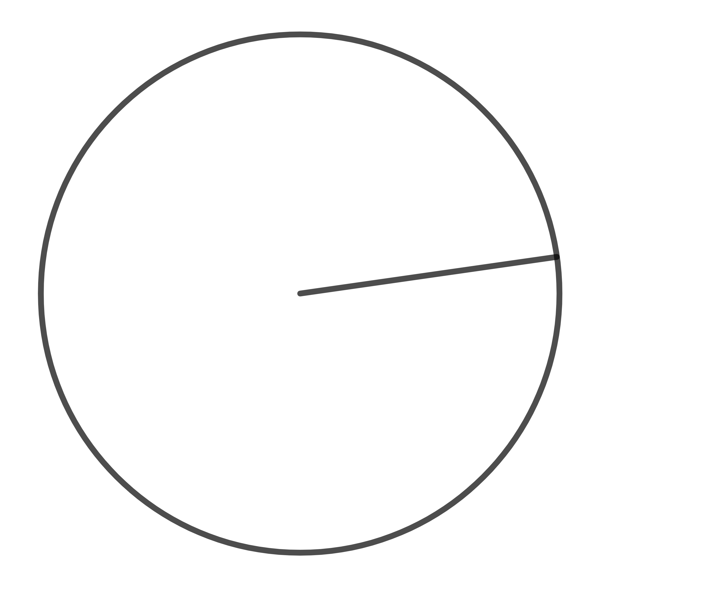

---
title: "Aires de figures, agrandissement et réduction"
geometry: "top=2cm, right=1cm, left=1cm, bottom = 1cm"
header-left: "CO-INTERVENTION |\\hspace{1cm}"
header-center: "\\thetitle"

lang: "fr"
table-use-row-colors: true
fontsize: 12pt
...

# AIRES DES FIGURES USUELLES

## Rectangle

{width=6cm}  
Aire = 

## Triangle

{width=6cm}  
Aire = 

## Trapèze

{width=6cm}  
Aire =

## Cercle

{width=6cm}  
Aire =

## Figures complexes

Pour calculer l'aire d'une figure complexe, il faut ....

# Agrandissement/réduction de figures

## Effets sur les grandeurs

Lors d'un agrandissement ou d'une réduction de rapport *k* :

 - les longueurs sont multipliées par .....,
 - les aires sont multipliées par .....,
 - les volumes sont multipliés par .....,

## Notation d'échelle

Un dessin à l'échelle 2:1 signifie que ses dimensions seront ......................plus ...................... que celles de l'objet dessiné.

Un dessin à l'échelle 1:3 signifie que ses dimensions seront ......................plus ......................  que celles de l'objet dessiné.