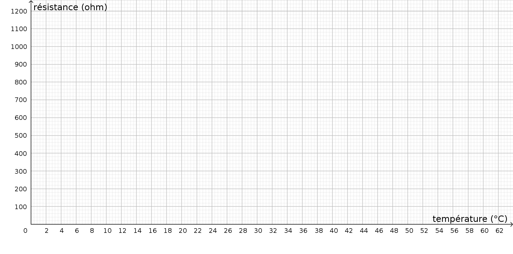

---
title: "Mesurer une température"
geometry: "top=2cm, right=1.5cm, left=1.5cm, bottom = 1cm"
header-left: "PHYSIQUE-CHIMIE |\\hspace{1cm}"
header-center: "\\thetitle"
header-right: "| Thermique"
fontsize: 12pt

...
NOM : $~~~~~~~~~~~~~~~~~~~~~~~~~~~~~~~~~$    | Prénom :     
Classe :

# Travaux Pratiques

Liste des compétences évaluées:

>- **S'approprier** : Rechercher, extraire et organiser l’information.
>- **Réaliser** : Mettre en œuvre les étapes d’une démarche.
>- **Réaliser** : Représenter (tableau, graphique...), changer de registre.
>- **Réaliser** : Effectuer des procédures courantes (représentations, collectes de données, utilisation du matériel...).
>- **Réaliser** : Organiser son poste de travail.
>- **Valider** : Exploiter et interpréter les résultats obtenus ou les observations effectuées afin de répondre à une problématique.
>- **Communiquer** : À l’écrit comme à l’oral : rendre compte d’un résultat en utilisant un vocabulaire adapté et choisir des modes de représentation appropriés.

### Matériel

- 1 thermomètre à alcool
- 1 thermistance
- 2 fils de connexion
- pinces crocodiles
- 1 multimètre
- 1 bécher d'eau froide
- 1 bécher d'eau chaude

### Consignes

 - [ ] Brancher les fils sur le multimètre (bornes COM et $\Omega$)
 - [ ] Brancher les pinces crocodiles sur les fils
 - [ ] Connecter les pinces crocodiles à la thermistance (attention aux faux contacts)
 - [ ] Placer le thermomètre et la thermistance dans le bécher d'eau froide
 - [ ] Tourner la molette du multimètre sur la partie ohmètre ($\Omega$)
 - [ ] Relever la température et la résistance et noter ce premier couple de valeurs dans le tableau *relevé de mesures* au dos de cette page.
 - [ ] Ajouter un peu d'eau chaude et relever un deuxième couple de température et noter le dans le tableau.
 - [ ] Recommencer l'opération précédente de façon à avoir en tout dix couples de valeur température-résistance

### Relevé de mesures
 

										
### Représentation graphique

 - [ ] Dans le repère ci-dessous, placer un point pour chaque couple température-résistance.
 - [ ] Relier ces points par un tracé (au choix : à la règle ou à la main levée).

### Exploitation

- Décrire en  une phrase comment évolue la résistance avec la température.

- Sortir la thermistance de l'eau et relever la valeur de la résistance. A l'aide de votre **représentation graphique** ou de votre **relevé de mesures**, donner une estimation la plus précise possible de la température.

